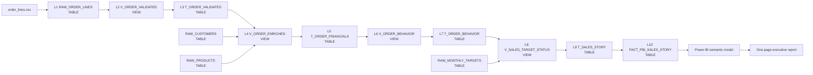

# Lineage Story

## Business scenario

Northstar Retail wants to explain why annual revenue recovered from a weak start and finished the year above target. The demo follows order-line data from four CSV files through ten Snowflake objects and into one Power BI page.

The final report answers three questions:

1. Are revenue and margin on target?
2. Which regions, categories, customer segments, and channels explain the result?
3. If an upstream table or measure changes, which report elements are affected?

## Primary ten-level chain

## Why tables and views are alternated

- Views make transformations and object dependencies visible.
- CTAS tables demonstrate materialized data movement.
- Customer, product, and target branches make the lineage graph interlinked.
- The final object is a physical fact table, which gives Power BI a simple and stable source.

## Demonstration moments

- Start at `FACT_PBI_SALES_STORY` and trace upstream through all ten objects.
- Start at `RAW_ORDER_LINES` and trace downstream to demonstrate impact analysis.
- Select `NET_SALES` or `GROSS_PROFIT` to explain column and measure lineage.
- In Power BI, select a visual using `[Total Revenue]`, then connect the measure back to Snowflake.

Snowflake records both view dependencies and data movement created by CTAS. Account lineage requires Enterprise Edition or higher and appropriate lineage/object privileges.
